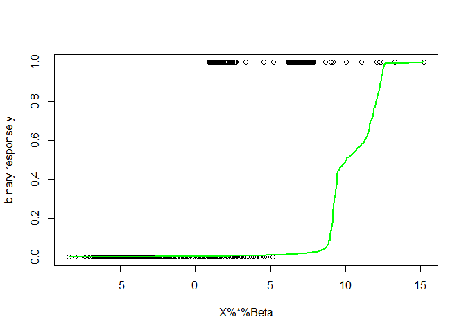
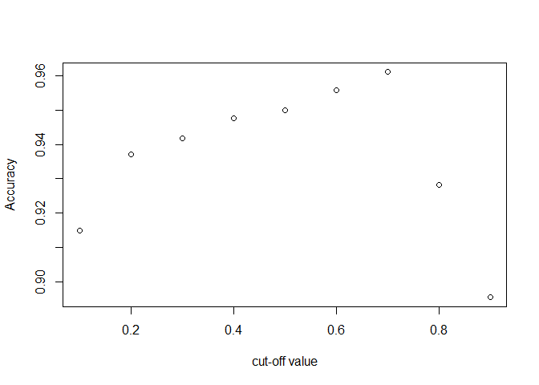

# Logistic Regression(logreg)

This package implements logistic regression using numerical
optimization. The functions in this package allow for you to:obtain the
least squares estimators. This is used as a starting point for
optimization, bootstrap confidence intervals for each predictor in the
logistic regression, plot the fitted logistic curve to the responses,
obtain a confusion matrix on the logistic regression and print metrics
calculated from the matrix, and have the ability to plot the given
metrics from 0.1 to 0.9.

First, install the package.

``` r
devtools::install_github("R-4-Data-Science/Final_Project_Group7/logreg")
```

    ## Downloading GitHub repo R-4-Data-Science/Final_Project_Group7@HEAD

    ## ── R CMD build ─────────────────────────────────────────────────────────────────
    ##          checking for file 'C:\Users\张易中\AppData\Local\Temp\RtmpmQD6Lp\remotes5cc3bc36c8e\R-4-Data-Science-Final_Project_Group7-f5680d3\logreg/DESCRIPTION' ...  ✔  checking for file 'C:\Users\张易中\AppData\Local\Temp\RtmpmQD6Lp\remotes5cc3bc36c8e\R-4-Data-Science-Final_Project_Group7-f5680d3\logreg/DESCRIPTION'
    ##       ─  preparing 'logreg':
    ##    checking DESCRIPTION meta-information ...  ✔  checking DESCRIPTION meta-information
    ##       ─  checking for LF line-endings in source and make files and shell scripts
    ##   ─  checking for empty or unneeded directories
    ##      Omitted 'LazyData' from DESCRIPTION
    ##       ─  building 'logreg_0.1.0.tar.gz'
    ##      
    ## 

    ## Warning in i.p(...):
    ## 安装程序包'C:/Users/张易中/AppData/Local/Temp/RtmpmQD6Lp/file5cc1d561db3/logreg_0.1.0.tar.gz'时退出狀態的值不是0

``` r
library(logreg)
```

In order to show examples, we will load data from class and format it
for use.

``` r
mydata <- read.csv("expenses.csv")

mydata$sex <- factor(mydata$sex, 
                     levels = c("male","female"), labels = c(0,1))
mydata$smoker <- factor(mydata$smoker, levels = c("yes","no"), labels = c(1,0))
mydata$region_northeast <- ifelse(mydata$region=="northeast",1,0)
mydata$region_northwest <- ifelse(mydata$region=="northwest",1,0)
mydata$region_southeast <- ifelse(mydata$region=="southeast",1,0)
mydata <- mydata[,-6]

mydata <- as.matrix(mydata)
mydata <- as.numeric(mydata)

mydata <- matrix(mydata, ncol=9)

X <- mydata[, c(1:4,6:9)]
Y <- mydata[, 5]
```

### Init

This function gives the starting value for the predictors of the
logistic regression. The specific calculation uses the least squares
formula given by $(X^TX)^{−1}X^Ty$.

``` r
(init_beta_demo <- init(resp = Y, pred= X))
```

    ##            [,1]
    ## c  4.648504e-01
    ##   -7.873921e-03
    ##   -2.118781e-02
    ##   -1.046147e-02
    ##   -1.329449e-02
    ##    2.997526e-05
    ##   -2.108683e-02
    ##   -1.855320e-02
    ##    2.314974e-02

## Boot_CI

This function will conduct a bootstrap routine for each predictor or
beta value for the logistic regression curve. The user is able to choose
the amount of bootstraps to conduct as well as the confidence level for
the intervals. Here, we will use it on the loaded data. We will use the
default values for n and alpha and X and Y for our response and
predictor variables.

``` r
(Boot_CI_demo <- Boot_CI(n=20, alpha=0.05, pred= X, resp= Y))
```

    ##                [,1]         [,2]
    ##  [1,]  0.0777721822  1.933748041
    ##  [2,] -0.0955752937 -0.052638803
    ##  [3,] -0.7424489645  0.423679144
    ##  [4,] -0.2279536863 -0.150887878
    ##  [5,] -0.3678999428  0.066747090
    ##  [6,]  0.0003130421  0.000395138
    ##  [7,] -0.4872871502  0.341299562
    ##  [8,] -0.2432183229  0.468932010
    ##  [9,] -0.3686206648  0.759621126

## log_plot

This function will plot the optimized logistic curve for the given data,
where the y-axis is the binary response y while the x-axis represents a
sequence of values from the range of fitted values from the logistic
regression.

``` r
log_plot(pred= X, resp= Y)
```

<!-- -->

## conf_mat

This function will create a “confusion matrix” using a cut-off value for
prediction at 0.5. It will also print the Prevalence, Accuracy,
Sensitivity, Specificity, False Discovery Rate, and Diagnostic Odds
Ratio metrics when run which can be calculated by values within the
matrix. The matrix is 3x3 with values representing the performance of
the logistic regression curve that we obtain.

``` r
conf_mat(pred = X, resp = Y)
```

    ## The Prevalence is 0.204783
    ## The Accuracy is 0.949925
    ## The Sensitivity is 1.000000
    ## The Specificity is 0.937030
    ## The False Discovery Rate is 0.196481
    ## The Diagnostic Odds Ratio is Inf

    ##      [,1] [,2] [,3]
    ## [1,] 1338  341  997
    ## [2,]  274  274    0
    ## [3,] 1064   67  997

## plot_metric

This function conducts logistic regression on the given data and plots a
given metric that visualizes the performance of the regression over a
grid of cut-off values for prediction going from 0.1 to 0.9 with steps
of 0.1. The metrics that can be entered are the same as the metrics
printed in conf_mat.

``` r
plot_metric(resp=Y, pred=X, metric = "Accuracy")
```

<!-- -->
